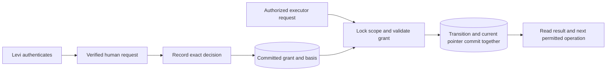

STATUS: TECHNICAL SHAPE CANDIDATE — NOT FROZEN OR IMPLEMENTED
DISPOSITION: PROJECTION
DATE: 2026-09-06 America/Phoenix

# BUILD 6 technical boundary

**Currentness — 2026-09-07:** [WebAuthn revision](008-build-6-webauthn.md) now supplies the preferred human-approval candidate following Levi’s correction. The Auth/session path, its principal fields, enrollment next handle and authentication tests below are superseded alternatives. Transaction ordering, exact P0, privilege separation and recovery constraints survive subject to the explicit WebAuthn reconciliation. No mechanism is frozen or installed.

The [human binding record](008-build-6-human-binding.md) supplies accepted H/remit and exact P0. This document develops the remaining mechanism under those subjects. It neither asks for their acceptance again nor claims an installed policy interpreter.

## Operation and credential separation

Recommend a verified Supabase Auth request at the human boundary, with the project issuer and immutable user subject explicitly bound to Levi. Email is an enrollment/discovery handle, not the authorization key. Account renaming does not move the designation; account replacement requires the applicable binding route. Anonymous Auth users, caller-provided actor data and user-editable metadata cannot supply the binding. A manager login for Supabase is not automatically a user of this project's Auth service.

The host's authenticator must verify token signature, expected issuer/audience and expiry before creating trusted request context. Internal SQL inspection of a caller-set JWT context is not cryptographic authentication. Direct database sessions able to set arbitrary context are outside the trusted HTTP-authentication path and must not receive human-decision privileges merely by setting those values.

| Caller / component | Permitted technical entry | Withheld |
|---|---|---|
| Unauthenticated client | Authentication flow only | Governance reads/writes and decision/execution entry |
| Authenticated human without binding | Identity confirmation; explicit not-designated response | Acceptance, withdrawal or execution by login alone |
| Bound root before genesis | Exact genesis-decision entry under the accepted external basis | Changing accepted P0/H/remit through request fields; another genesis after success |
| Installed H | Exact succession decision, own pending-decision withdrawal/decline and authorized inspection | Direct state writes, delegation, self-enlargement, bootstrap reuse |
| Operating agent | Scoped inspection and submission of a previously authorized execution request | Human decision issuance, identity enrollment, Auth-admin access, raw owner credentials |
| Transition function owner | Minimum native-table writes and Referent registration required by the verified operation | Login, role creation, superuser/BYPASSRLS, unrelated tables, external network effects |
| Migration / platform custody | Explicitly commissioned installation and administration | No claim that this privileged capability proves normative authority or is constrained by ordinary-caller checks |

A kernel bearer token may remain an agent-facing access credential, but is not a human approval credential. Service-role/Auth-admin access, signing-key access, owner DDL, or possession of a human session can defeat the ordinary-caller boundary. BUILD 6 must name these custody limits and qualify the operating deployment accordingly. Do not expose a privileged connection or Auth-admin tool to the operating model and claim that a SQL check prevents it from impersonating H.

## Concrete function and privilege arrangement

Proposed private schema: `ecb_governance`, not an exposed PostgREST schema. Native tables and privileged functions live there. Existing public kernel tables/functions are unchanged.

Recommend narrowly granted SECURITY INVOKER public wrappers that dispatch to private functions. Private effectful functions run as a purpose-specific NOLOGIN owner and validate the operation themselves, including authenticated principal/role where applicable. An invoker wrapper cannot call a private function without the caller's necessary EXECUTE/USAGE privileges: grant those explicitly only to the qualified caller role. The private function must therefore remain safe even if that same role reaches it through another allowed route. Do not rely on the wrapper as the only check or assume “private schema” substitutes for privileges.

Revoke PUBLIC execution at creation and remove default role grants in the same installation transaction. Use fixed empty search paths and qualified identifiers, no dynamic caller-selected function/table names, no grant to create in the private schema, and no table writes for ordinary roles. Private tables use RLS as defense in depth with owner privileges precisely declared. The native function owner may bypass its own table RLS through ownership, but receives no general bypass role; authorization checks remain explicit function obligations.

Authentication-qualified human operations reject service-role/agent requests. Execution can be transported by an agent credential only when the exact committed grant includes that permitted execution class. Whether a human-authenticated caller also invokes execution is a technical capability choice, not broader H normative power. The agent cannot turn an inspection response into such a grant.

**Candidate logical entries:** inspect scope; retain candidate subject; record exact human decision; record withdrawal/decline; execute genesis; execute succession; recover exact outcome. These are operation responsibilities, not seven automatically commissioned MCP tools. The existing three-tool kernel inventory remains unchanged by Shape. Access work should expose the smallest necessary human/agent routes and descriptions after qualification.

## Record shape and integrity

Four native record families retain separate meanings:

* `subjects`: Referent ID, bounded kind, exact UTF-8 payload, format identifier, database-computed SHA-256, provenance/source references, database creation metadata. Kinds needed here are policy, remit, accepted external basis and principal/scope binding. No content is authoritative merely by being retained. All are immutable.
* `decisions`: Referent ID, scope, bounded operation, exact target subjects/digests, expected current transition, actual issuer/subject, prior authority reference, permitted executor class, source acceptance reference, request identity/fingerprint and database creation metadata. Withdrawal targets the original decision. Decision history is append-only; the effective unwithdrawn state is queried from that history under the scope lock.
* `scopes`: Referent ID, accepted binding reference and current-transition pointer. A scope is created before genesis as non-operative addressability. The binding is immutable; only the verified transition changes the pointer.
* `transitions`: Referent ID, scope, predecessor, decision, exact resulting policy/designation references, ordered genesis obligations or succession, executor identity/class, database sequence and request identity/fingerprint. Append-only; no cascade deletion.

These are candidate columns/responsibilities, not frozen DDL. Subject-kind checks supplement universal Referent foreign keys. The current pointer is constrained to a transition in the same scope; predecessor scope must match. Unique genesis per scope and successor per predecessor prevent multiple authoritative branches. At every effect, validate pointer/chain correspondence before advancing; never silently rebuild a mismatched pointer from timestamps.

Use the scope row as the serialization point for decision creation, withdrawal, effect and outcome reconciliation. Choose a consistent lock order: scope first, then any other locked records. Immutable subjects need exact validation but no changing-content lock. No decision may be created or executed against a predecessor that becomes stale while the operation holds the scope lock.

A decision must have committed in a prior top-level transaction before an effect consumes it. Merely calling “record” then “execute” inside one outer transaction fails that obligation, including across savepoints. Adapt BUILD 5B's top-level transaction provenance check for this exact purpose; retain the distinction between local execution metadata and portable semantic authority. Re-imported transaction identifiers require requalification and cannot prove prior commitment in another cluster.

## Exact policy interpretation

The accepted P0 bytes and SHA-256 remain unchanged. Parse as a closed, versioned format. Reject duplicate object keys before any parser normalization, unknown/missing keys, wrong JSON types and extra nested content. All fixed fields and the ordered `preserves` array match the accepted profile exactly. Only the actual JSON boolean `requires_human_explanation` varies across supported successors. Never coerce the string `"false"` into a Boolean or silently strip unrecognized fields.

Keep byte identity separate from semantic validation: both are required. Reformatting creates different accepted bytes even if the semantic profile is identical. A recorded grant binds its subject/digest; the executor does not recompile the policy and guess equivalence.

When recording a succession decision, evaluate explanation requirements under the currently operative policy, not under the candidate it would install. Otherwise a candidate can set its own approval conditions. The proposed P1 changes this requirement from false to true; subsequent decisions without an explanation should be rejected under P1. This is the concrete behavior distinguishing P0 from P1 in the proposed qualification case.

## Recovery and conflict responses

The response must identify the scope, decision/request, actual current transition and whether an effect is confirmed, not committed under an established read, or unknown. These are proposed protocol outcomes, not new epistemic standing values.

* Exact prior success: return its transition and historical outcome with no new effect; do this before testing whether the old authority could be exercised again.
* Same request identity with changed input: return a request conflict; never reinterpret it as another approved operation.
* Withdrawn decision: name that decision and withdrawal; ask for no substitute approval automatically.
* Stale predecessor: show expected and actual current references; a new decision must be made under the actual basis.
* Unknown outcome: give the recovery/read operation; do not offer a blind write retry or imply the effect failed.
* Unsupported policy: name the unsupported field/format and the change route, rather than treating it as a parsing inconvenience.
* Missing human binding: state that the person is authenticated but not bound to this authority in this scope.

No external effect is included in genesis/succession. Therefore a rolled-back effect need not leave a durable failed-attempt row to prove that no governance transition occurred. The prior committed decision and authoritative scope-locked reconciliation suffice for the effect boundary. Operational logs may retain attempts but cannot substitute for canonical transition evidence.

## Proposed qualification package

Reuse accepted predecessor reconstruction and PG17 rehearsal tooling as evidence/patterns without editing historical suites. The following checks become executable only after actual identity/scope bindings and the applicable fixture freeze; they are currently candidate expectations:

1. Human-bound acceptance succeeds; unsigned/expired/wrong-issuer token, unbound authenticated user, anonymous Auth user, caller actor spoofing and service-role approval fail. Test via the real authentication gateway as well as database boundaries; manually setting SQL JWT context is not proof of authentication.
2. Exact retained policy succeeds. Duplicate keys, type coercion, changed fixed fields, changed digest, wrong subject kind and cross-scope references fail.
3. Same-transaction acceptance/execution fails; prior-committed acceptance succeeds. Savepoint tricks do not create prior commitment.
4. Paired concurrency runs exercise winner commit and rollback for genesis, succession and withdrawal versus execution. Observe actual blocking, not a sleep followed by assumed ordering.
5. Terminate before commit and drop acknowledgement after commit. Reconstruct under the scope lock and demonstrate no duplicate effect. No speculative read can certify retry eligibility.
6. Direct table writes and internal function misuse fail for each declared ordinary caller. Verify function ownership, search paths, schema exposure, grants/default grants, role membership, direct-SQL/JWT-context routes and Auth-admin capability exposure.
7. P0 permits the constructed exact P1 approval without an explanation; once P1 is operative, the same decision shape lacking explanation is rejected, while a valid explained one is accepted as a decision. Do not install another successor merely to test its acceptance condition.
8. A fresh operator can recover policy, H/remit, prior basis, pending decision, withdrawal/conflict, exhaustion and next operation without this conversation. Removing a presentation surface loses no canonical governance state.

No check in this list has run. No executable fixture, schema migration or runtime code is introduced by this file. Technical feasibility follows from qualified implementation evidence, not this design's completeness.

## Remaining binding and next handle

H=Levi, the stated remit and exact P0 are already accepted. The pending user question asks only which account identifies Levi for technical enrollment. Actual issuer/subject and scope identifier still require explicit binding, not inference from an email or manager account. The already designated canonical project is `ecb-v2-brain` (`vezxivrvhakclxuvxzso`) under ADR-002; propose one BUILD 6 governance scope within it, without inventing another canonical project.

Once the account handle is supplied, prepare its exact binding route and the scope-binding record. Do not expose credentials in the repo or conversation. Freeze the worked episode only after these bindings and the technical mechanism are resolved. Then present the exact implementation boundary with tests and recovery, following the existing Move-release route.

Sources: accepted [Build Contract](../build-contract.md), [human binding](008-build-6-human-binding.md), [mechanism candidate](008-build-6-mechanism-candidate.md); local BUILD 5B tooling and source; [Supabase RLS/grants](https://supabase.com/docs/guides/database/postgres/row-level-security), [session semantics](https://supabase.com/docs/guides/auth/sessions) and [PostgreSQL function privileges](https://www.postgresql.org/docs/17/sql-createfunction.html). Documentation informed the design; no live Auth configuration or canonical database state was inspected in this pass.
