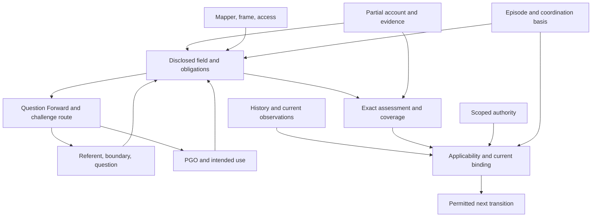

# ECO-191 — Formal Sense return

24 September 2026 · Register B · stopped at the Sense → Shape border

Controlling commission: [ECO-191](https://linear.app/ecos-ops/issue/ECO-191). This return includes the Principal's subsequent bootstrap-orientation hypothesis. It proposes no production change and does not implement ECO-190.

## Outcome and practical consequence

A specific formal Shape candidate is earned: **partial, explicitly indexed accounts; typed transitions with declared effects; and use-relative constraints with recoverable dependency history**. This is descriptive terminology, not a proposed product name or new canonical ontology.

If subsequently shaped and installed, the system could reject a judgment applied to the wrong question or basis; distinguish a permissible refocus from an unannounced subject change; expose new obligations after a changed purpose; and recover a parent inquiry without mistaking its child's success for permission to continue. These consequences follow from the candidate laws below. They do not require a general theorem prover.

The most consequential new candidate is a **two-part change obligation**: reassess old dependency support **and** reconstruct the obligations that become relevant under the new seat/orientation. An old dependency graph alone cannot establish adequacy for a newly framed use. A finite countermodel demonstrates the omission.

The bootstrap addition earns a second precise result: a content-neutral procedure cannot uniquely select a warranted R or PGO from perfectly symmetric, insufficient input without another distinguishing input or an explicit selection policy. It can lawfully preserve alternatives, ask a discriminating question, or recover a prior orientation. A general convergence guarantee is not earned.

The axiom-minimization challenge produced useful conditional derivations, but **not a proven globally smallest or logically independent axiomatization of SIGMA**. This return passes on predictive change/self-application constraints, a useful finite solve-for surface, and a reusable falsifier—not on primitive-count reduction.

## 1. Evidence recovery and standing

Sources were live-recovered from Linear and the repository. Repository main was pinned at `1dee29328edc06aa4661f9dae5c0aeb00dc918a0`; the working checkout was clean. BUILD 7′ evidence was separately recovered from open/unmerged PR #67 at `70770d274fcf11ceacdfcbea0c09bca76af1c518`. Main and the review branch were not conflated.

| Source | Recovered consequence | Standing used here |
|---|---|---|
| [ECO-136](https://linear.app/ecos-ops/issue/ECO-136), [ECO-51](https://linear.app/ecos-ops/issue/ECO-51) | Stable reference does not settle boundary or exhaust content; enrichment and explicit reseating differ; seating checker includes PGO adequacy | Current written contracts; mechanical semantic checker not installed |
| Quadrant functional contract v0.2; [ECO-143](https://linear.app/ecos-ops/issue/ECO-143) | Cross relational seat with answer burden; evidence access and phenomenology do not generate quadrant identity | Qualified bounded semantic behavior |
| [ECO-144](https://linear.app/ecos-ops/issue/ECO-144), [146](https://linear.app/ecos-ops/issue/ECO-146), [147](https://linear.app/ecos-ops/issue/ECO-147), [148](https://linear.app/ecos-ops/issue/ECO-148) | Ten requirements; situated basis, inquiry, applicability reconciliation, reliance qualification; distinct semantic and mechanical checks | Requirements/logical/physical descent, with later supersessions retained |
| [ECO-149](https://linear.app/ecos-ops/issue/ECO-149), [159](https://linear.app/ecos-ops/issue/ECO-159) | Same-channel PASS could support the wrong inquiry before exact-input repair | Qualified isolated implementation counterexample and repair, not production installation |
| [ECO-179](https://linear.app/ecos-ops/issue/ECO-179) and episode closure | Focal-local possibility/dependency sharpening; same-rock illustrations; focal indexing placement unresolved | Sense remains open; do not promote its pre-Sense hypothesis to a newly accepted universal generator |
| [ECO-184](https://linear.app/ecos-ops/issue/ECO-184), including post-close comment `2a470ad2-b211-40b3-882c-5798e4ffd4a9` | Directional-capacity/tendency/drive is one modal bundle; capability composition and longitudinal Lines remain distinct | Closed B standing, corrected by the later comment |
| [ECO-185 repair v0.2](https://linear.app/ecos-ops/document/eco-185-state-line-stage-shape-repair-v02-pgo-enrichment-re-seating-72cd51d5f51d) and current issue | Stage entails an earned Level relation after adequate PGO/enrichment/reseating; Q/Γ alone gives regimes | Accepted B semantics; cold-transfer replication deferred to Register A |
| BUILD 7 closure receipt 028; [ECO-150](https://linear.app/ecos-ops/issue/ECO-150), [151](https://linear.app/ecos-ops/issue/ECO-151), [152](https://linear.app/ecos-ops/issue/ECO-152) | Resolution, qualification, authority, binding, current reliance separate; equal-looking historical payload cannot replace exact lineage | Historical disposable proof and separately qualified isolated B7′ candidate |
| [ECO-107](https://linear.app/ecos-ops/issue/ECO-107), [108](https://linear.app/ecos-ops/issue/ECO-108), [109](https://linear.app/ecos-ops/issue/ECO-109); BUILD 9 code and raw retained results | G1 substitution/removal; exact return; D2 independence; ABA; parent reentry | Closed bounded B proof; one active child/one depth, synthetic and non-amending |
| [Temporal Fractal checkpoint](https://linear.app/ecos-ops/document/temporal-fractal-ssmm-freeze-metabolize-checkpoint-0774206a5b15) | Inquiry nesting, causal history, and constituency are different relations; sparse explicit recursion | Provisional feed-forward except where later qualified |
| [Reflective Compiler checkpoint](https://linear.app/ecos-ops/document/ecos-as-reflective-knowledge-compiler-coordination-substrate-d1fcb60f910d) | Rules can become subjects; compilation/recovery are not inverses | Prior architectural hypothesis, not a theorem |
| [ECO-161](https://linear.app/ecos-ops/issue/ECO-161), [162](https://linear.app/ecos-ops/issue/ECO-162) | Three macro families plus independent fidelity coordinates; bootstrap warrant; challenge route outside ordinary relevance filtering | Accepted B architecture |
| [ECO-183 v0.3](https://linear.app/ecos-ops/document/eco-183-generative-basis-clarification-v03-seat-descent-composition-f7f64743b373) | Generative orchestration basis does not contain all domain/descent machinery | Principal accepted; supersedes the earlier holdout gate |
| [ECO-189](https://linear.app/ecos-ops/issue/ECO-189) Shape return | Coordination is a projection over independently standing constituents; canonical custody is not external reality; reconstitution needs revalidation | Shape return used as downstream contract; no installation inferred |
| [ECO-92](https://linear.app/ecos-ops/issue/ECO-92), ECO-161 bootstrap recovery; Principal's added response | Provisional engagement can precede a hardened PGO; recover → provisionally orient → reexamine | Existing bootstrap lineage plus new dispositional-kernel hypothesis; no recovered proof of convergence |

**Supersession resolutions.** ECO-191 explicitly asks for a smallest sufficient formal seed; older objections to minimizing implementation breadth do not prohibit this commission. They still prohibit deleting earned semantics to improve the count. ECO-185's current closure supersedes its repair document's historical cold-worker gate. ECO-184's Direction→Capacity drawing is historical where it suggests two primitives. ECO-179's refined UL definition is a hypothesis; the earlier qualified question-burden contract supplies the accepted Quadrant fixture.

**Physical-evidence limit.** This session inspected code and retained result bytes, and ran a new finite mathematical diagnostic. It did not rerun the historical database suites or inspect current production Supabase. Production installation is not part of the proof claim.

## 2. Deriving the variable inventory

Begin with distinguishable operational changes, not a mathematical school. A subject can remain fixed while its question changes; a qualification can survive while authority is revoked; a historical PASS can remain true while present reliance fails. Any representation identifying those states loses observed behavior.

Use a **partial engagement**

`S = (K, H; r, b, f, g, q, t, u; e, w, a, z)`.

This is an inspection notation, not one database object. Coordinates can resolve by reference and have explicit unknown values. The semicolons group roles, not levels of fundamentality.

| Coordinate | Semantic content and independent variation | Evidence requiring it |
|---|---|---|
| `K` | Recoverable partial account: typed referents, descriptions, relations, versions and declarations. Not reality itself | URG open-world contract; map ≠ referent |
| `H` | Typed event/derivation lineage, including causal predecessor identities | B9 ABA and reentry; B7′ counterfeit history |
| `r` | Current focal referent designation; unresolved/candidate designations allowed during bootstrap | Refocus differs from changed evidence |
| `b` | Boundary criterion, grain, domain and temporal scope; keep components distinguishable | Constituency vs necessity/enclosure; boundary revision |
| `f` | Mapper, frame, access route and their qualification, separately inspectable | ECO-161 independent-change evidence |
| `g` | PGO: purpose, relevance, outcomes, sufficiency/failure/reentry; resolution/edition references | Reorientation without ontology mutation |
| `q` | Present question/initiating contrast, including the relation and answer burden sought | B9 same R/different question result-swap rejection; Quadrant traversal |
| `t` | SSMM episode, phase, parent/return binding and applicable coordination basis | Same referent can occur in different episodes; historical ≠ current |
| `u` | Declared use/consumer/environment when consequential | Qualification for one use does not authorize another |
| `e` | Evidence and observations: source, observation time/scope, content and availability | Missing acknowledgment ≠ event absence |
| `w` | Claim-specific assessment/warrant/method/limits, exact assessed inputs and epistemic standing | A retained PASS string is insufficient |
| `a` | Actor/custody and scoped authority/authorization bases; bind and act permissions separate | B7′ reviewer ≠ binder; phase ≠ authority |
| `z` | Apertures: unknowns, alternatives, QF question, paired outcomes, sensor and reentry route | Inactive ≠ absent; bounded recursion |

These are **semantic degrees of freedom**, not fourteen proven atomic variables. `e,w,a,z` may be typed parts of K; `t` may be reconstructed from H. Writing them separately makes their independently variable roles visible rather than claiming an irreducible tuple size.

**Derived quantities:** current binding `cur = Fold(H, scope)` under the applicable transition rules; current admissible reliance; relative micro/macro role; disclosed relational field; quadrant obligation; active/deferred disposition; Stage presentation. Currentness is not an independent truth bit editable outside the transition history.

**The field:** `Φ(S) = Disclose(K,e,z | r,b,f,g,q,t,u)` returns a partial account of relevant relations and possibility/dependency structure, together with unresolved discovery obligations. `Disclose` is a semantic task interface, not an assumed complete algorithm. Its output is not the entire field that actually obtains. PGO governs disclosure and consequentiality; it does not create or erase the world's relations.

`q` is a necessary addition to the initially suggested coordinate list unless its complete function is explicitly retained inside another coordinate. Hiding it inside an unspecified “context” would fail BUILD 9's same-subject/different-question control.

## 3. Candidate seed assumptions and minimization ledger

The following ledger separates inherited commitments from results. These are candidate assumption families, not nine indivisible axioms. Ordinary set/tuple/equality notation supplies the metalanguage; it supplies no SIGMA semantics for free.

| Seed | Independent commitment used | Removal witness / what cannot then be derived |
|---|---|---|
| A1 Identity and index | A claim has an explicit subject, question/use and scope; reference continuity is distinct from representation and role | Equal words about different subjects/questions become interchangeable; B9 P02 fails |
| A2 Partiality | Account absence is not negation; unresolved and contradictory support remain distinguishable | Unseen acknowledgment becomes nonoccurrence; latent relations disappear |
| A3 Typed separation | Semantic qualification, governing relevance, authority and transition standing have distinct introduction rules; no implicit coercion | PASS becomes permission or relevance becomes existence |
| A4 Attributable support | Consequential judgment binds exact proposition, evidence, method and applicability basis | ECO-159 cross-basis PASS and B7′ historical counterfeit pass |
| A5 Controlled change | A transition declares its write set, preserves other coordinates, retains predecessor/history, and checks its required authority | Silent R/PGO substitution and endpoint-only ABA pass |
| A6 Use-relative dependency | A relied-on conclusion must account for its required premises at the current use/index; affected or uncertain support requires explicit disposition | Child answer replaces D2; stale old-use coverage licenses a new use |
| A7 Role-neutral focal eligibility | A legitimately individuated, addressable system structure is eligible for the same focalization grammar as another referent | Governance can only be inspected in an unrelated meta-system |
| A8 Bounded aperture | Material undecided branches have a calibrated question and consequence/reentry route; inquiry can HOLD; scope closure need not close reality | Unbounded recursion or fabricated completion |
| A9 Provisional entry | A declared bootstrap remit permits provisional preservation/orientation before completed qualification, without granting binding/effect authority | Infinite regress demanding completed orientation before its first inquiry |

These removal witnesses establish **necessity relative to the recovered behaviors**, not full model-theoretic independence. A3/A5/A6 interact; repackaging them could change the count. No global minimality theorem is claimed.

Additional domain seeds are exposed rather than hidden:

* **D1 Quadrant seed:** the accepted constitutive/participatory distinction and possibility-burden/determinate-burden distinction, their independent availability, and the obligation to consider their cross-product. They are not derived from A1–A9.
* **D2 Constitutional seed:** a Level witness requires scoped asymmetric dependence **plus constitutive organization**, not merely chronology, causal necessity, inclusion, or ordinal labels.
* **D3 Developmental seed:** Line continuity and the accepted Stage-as-PGO-relevant-Line-presentation-of-Level contract. The four directions remain an accepted modal bundle; their exhaustiveness is not derived here.
* **D4 Fixture premises:** actual comparator criteria, child remit, parent routing priority, thermostat rule, dressing sequence and non-agentic toy rules. No abstract calculus generates those domain facts.

**Reconstruction result.** A1–A6 derive strict non-transfer of qualification across changed exact inputs; A1/A2/A5/A6 derive the reseating checks; A3/A5/A7 plus the child contract derive non-authorizing self-application; A1/A5 with a typed nesting relation derive scale relativity. D1 derives four coordinate obligations and the thermostat result. D2/D3 constrain Stage. This is a reduction of repeated obligations to shared rules, not a derivation of all SIGMA from identity alone.

## 4. Constraint/dependency graph

An arrow means “may be a declared decision-bearing input,” not causation or automatic invalidation. Edges are typed and use-scoped.



Keep at least four relations separate: `constituent_of`, `inquiry_child_of`, `depends_for_use`, and `happened_before`. A recursive call is not a constitutional Level; a Level relation is not evidence of causal precedence; a causal edge is not authority.

For a fixed, enumerated local dependency graph, define `Affected_old(Δ)` as the conclusions reachable from changed premises along declared dependence edges. If edge materiality is unknown, retain a conservative affected scope and an impact question. Do not advertise this closure as discovering undeclared dependencies.

Define `Req(S',u)` as requirements exposed for the new seat/use and `Accounted(S',u)` as requirements satisfied or lawfully dispositioned. For positive use, a decisive unknown cannot count as satisfied merely because it has a QF entry.

The candidate change obligation is:

`Reconcile(S→S',u) = CheckAffected(Affected_old(Δ)) AND CheckCoverage(Req(S',u), Accounted(S',u))`.

The first term protects earlier support; the second prevents an old qualification envelope from masquerading as a complete new one. Semantic discovery supplies Req; a structural checker can enforce the declared coverage obligations and exact bindings.

## 5. Candidate laws

### 5.1 Reseating law

Let `s=(r,b)` and let `s'` be a candidate seat. A lawful reseat requires an explicit target, boundary/grain/scope, continuity relation, local purpose, and an inspectable reason. The continuity relation must distinguish **same referent/revised boundary or account**, **different existing referent**, and **newly individuated composite**. It is not assumed to be identity.

`Reseat(S,s',j) ⇀ (S', receipt)`

with:

1. `f,g,u` remain fixed unless separately declared changes are composed; `q` must be checked for applicability to the new seat and explicitly rebound or exteriorized. A bare textually identical question is insufficient.
2. `Φ(S')` is re-exposed under the new index. Constituency/participation, relevant Level candidates and process-scale roles are recomputed as applicable; they are not copied as intrinsic labels.
3. Old referent identities, exact assertions and their original support/history remain recoverable. An old assertion stays about its original subject.
4. Old relied-on conclusions undergo the two-part reconciliation above. Neither “invalidate everything” nor “keep everything because IDs exist” is licensed.
5. No new referent row, physical object, semantic truth, authority or current binding follows merely from the new focus.

**Recoverability:** focus can return to the prior seat using retained identity and boundary. Current qualification cannot generally be restored by an inverse because evidence, authority or history may have changed. `ReseatBack(Reseat(S))` is not necessarily S. Historical reconstruction is not temporal reversal.

**Prediction:** if a formerly external database is included in the newly declared service boundary, a service–database relation can become constitutive at that new seat. The original participatory answer remains historically indexed to the former boundary; it does not silently migrate.

### 5.2 Self-application law

For a generated/used structure `x`, let `ref(x)` designate **that structure itself**, not whatever it represents. A relation Claim, judgment, PGO resolution, episode, map or this report can occupy that role.

`SelfFocus(S,x,j) = Reseat(S, seat(ref(x)), j)`

provided individuation and focalization conditions are met. If x already has suitable referential identity, reuse it. If not, establish semantic identity at the needed resolution; durable physicalization is separately governed.

The grammar of inquiry does not change. The new account can inspect x's constituents, operation, relevant relations and warranted possibilities. x's output standing does not become authority over the inspecting process. A representation of a rule is not identical to the rule's execution, nor to permission to amend it.

**Bounded recursive extension:** where the parent actually depends on x, open a child using the ordinary episode grammar. Bind the exact parent, dependency, x/version, child question, criteria, remit and return location. Returning supplies evidence only to that dependency. Parent reentry separately checks remaining conditions and present applicability.

This is **same-grammar closure of focal eligibility**, assumed in A7 and physically exemplified in B9. It is not a truth predicate, untyped self-evaluation, unlimited recursion theorem, fixed point, or self-amendment right. A cyclic description need not create a cyclic justification; a cycle that provides all its own warrant supplies no independent support.

### 5.3 Tri-axial interaction law

At the orchestration seat, URG determines expressible/indexed subject and relation structure; PGO determines present consequentiality and sufficiency; SSMM governs legitimate change/coordination. The candidate interaction is constrained composition, not three independent numeric axes:

`Admissible(S,o,u) ⊆ WellIndexed(S,o) ∩ SufficientFor(S,g,u) ∩ TransitionLegal(S,t,o) ∩ Fidelity(S,o,u)`.

The subset symbol is intentional: these are necessary families, not a universal sufficient-condition theorem. Scoped authority remains independently required whenever the operation calls for it.

A primitive edit to one family triggers assessment of dependencies in the others, not automatic mutation of their identities. PGO reorientation can require another seat; that next reseat is an explicit operation. Changing phase cannot choose a new PGO or authorize an act by implication.

Two transitions commute on selected observable coordinates only if their write/read footprints do not interfere **and** their guards, discovered requirement sets and authority bases remain valid in both orders. Reseat then reorient often fails that condition. Historical event sequences remain different even when final projections agree. No commutativity or orthogonality theorem is assumed from the word “axis.”

## 6. Typed operator inventory

**Common contract for every operator below.** Input is a partial S plus explicit operator arguments. Result is a new partial S and attributable receipt, or a typed undefined/rejected/HOLD result. Historical inputs survive. Every changed coordinate must be in the declared write set; all others are forbidden to change silently. An inspection/proposal does not acquire commitment/effect authority. A material index/basis change schedules the two-part reconciliation. “Freeze rest” below invokes all these obligations, including preservation of identity, source standing and latent unknowns.

| Operator | Preconditions/input and exact output | Permitted changes; forbidden silent changes | Failure/undefined and recovery |
|---|---|---|---|
| `Seat` | Candidate designation, provisional or adequate G, boundary/grain/scope and declared inquiry remit → focal designation plus initial coverage/gap account | r,b,q bindings and receipt; freeze g,f,a and source facts | Ambiguous target remains alternatives/QF; cannot assert reliable traversal without sufficient orientation. Prior encounter retained |
| `Enrich` | New attributable evidence/relation consistent with unchanged boundary criterion → added/revised account and affected warrant disposition | K,e,w,z and observations; r,b,g stay fixed | Contradiction retained and adjudicated; explicit formerly excluded constituent requires boundary revision. Recover old account; no claim of inverse deletion |
| `Individuate` | Distinguishable candidate plus criterion and source → semantic referent identity/description or unresolved candidates | K, identity/lineage links; focus changes only through Seat | Unsupported co-reference/identity forced from similar wording is undefined. No automatic new persistent ID |
| `Relate` | Typed endpoints, scoped predicate, evidence or stipulation → attributed relation claim | K,e,w,z; freeze endpoint identities and focus | Ill-typed endpoints or unsupported promotion rejected. Retraction/supersession preserves original claim |
| `Compose` | Components plus explicit organizing/dependency relation and identity criterion → composite candidate | K and compositional lineage; no automatic focus/Level/authority | A list alone does not establish constitutive organization. Components remain recoverable; decomposition need not uniquely recover intent |
| `Reseat` | Conditions of §5.1 → new focal/boundary index and required re-exposure | r,b; q rebind explicitly; t records consequential coordination change; derived Φ/w applicability may change | Missing continuity/boundary/PGO adequacy blocks affected reliance. Return to old focus is possible, inverse currentness is not |
| `ChangeFrame` | Declared new mapper/frame/access and transport method if claims are reused → reattributed view plus warrant review | f,e,w,z and derived Φ; r,b,g fixed | No automatic inference that frames are equivalent; unsupported transport remains unknown. Coordinate conversion may invert; lost evidence/access may not |
| `Reorient` | Proposed G edition with purpose/criteria and appropriate standing → candidate new G; current use only after required qualification/binding | g, requirement/activation views,w applicability,z; r,b,world-claims,a unchanged | Underspecified G supports only bounded clarification. Old edition recoverable; old permission not revived automatically |
| `Open` | Parent or root remit; explicit q; material decision contrast; child need not safely discharge at parent resolution; required authority → episode/child contract and dependent suspension | t,H,z; child's r/b/g/q explicitly bound; no rewrite of parent's values | No discriminating consequence, unavailable remit or unbounded mandatory regress → no child/HOLD/QF. One-depth B9 is evidence limit, not universal rule |
| `Suspend` | Current episode and affected continuation/condition → suspended dependency or episode with reentry route | t,H,z; freeze semantic answers and independent episodes | Missing recovery route makes suspension inadequate; resume requires Reenter rather than erasing event |
| `Close` | Phase-specific sufficiency and stop checks under exact basis → closure receipt with unresolved dispositions | t,H,z; freeze a and subject truth | Material unaccounted gap blocks claimed closure; closure does not itself open successor or install anything. Reopen is a successor transition |
| `Return` | Exact child/attempt/parent/dependency/question/version/remit match → received judgment at named dependency | t,H,e,w links at that dependency; no current permission or other dependency update | Wrong sibling/question/basis rejected. Duplicate replay recovers same event; return cannot be undone by forgetting it |
| `Reenter` | Return or external trigger; fresh applicable observations; exact predecessor; current parent conditions → CONTINUE/REQUALIFY/REORIENT/HOLD with QF | t,H and use-relative applicability; g/r only by separately declared reorientation/reseat | Missing evidence → HOLD; stale predecessor → conflict; route priority is contract-specific. Recovery of old route is historical only |
| `Requalify` | Exact old/new basis, assessed proposition/use, method/warrant and impact scope → new bounded assessment | w,e,z,H; no authority/current binding implied | Unknown impact stays unresolved; invented historical basis rejected. Prior assessment remains inspectable |
| `ExteriorizeQF` | Material unknown/alternative; discriminating question; consequence pair; notice/reentry route or explicit unavailable route → aperture and interim reliance limit | z,active view,H as consequential; freeze existence/truth/authority | Vague “more info” is insufficient; decisive unknown cannot be deferred into positive use. Reactivation recovers aperture and requalifies |
| `Project` | Exact constituent/source references and declared display/use transform → read-only view with provenance/loss declaration | New representation in K if retained; underlying r,g,t,w,a and bindings unchanged | Unresolvable governing inputs marked unknown; pretty view cannot self-certify. Generally lossy/noninvertible |
| `SelfFocus` | Addressable generated/used x plus same focalization inputs → x itself becomes R using Reseat | As Reseat, with representation/represented-object distinction retained | A string mentioning x is not identity with x. Reenter prior focal engagement by retained lineage; no new meta-grammar |
| `Bind` | Exact qualified resolution/use, correct predecessor, independent designation authority and current observations → scoped current binding event | H,t,currentness projection; no truth/action authorization mutation | Qualification-only, wrong authority or ABA basis fails. Withdraw via explicit successor; historical replay stays historical |
| `Bootstrap B` | Encounter/recovery inputs, declared kernel policy/remit, access constraints; no completed R/G required → provisional candidates, recovered orientation, discriminating question, READY or HOLD | Provisional r,b,f,g,q,t,z and attributable observations; no semantic facts or authority invented | Symmetry, contradiction, missing access, or no discriminating path can block resolution. Retain alternatives/checkpoints; no general inverse or convergence guarantee |

A “minimum operator set” can share the underlying guarded transition mechanism without collapsing these different semantic contracts. Compound operations—e.g. enrich then compose then reseat—must retain their separate effects and dependency receipts.

## 7. Fixture derivations and controlled perturbations

All illustrations declare a local purpose. Actual retained B9 evidence is distinguished from new stipulated analytical fixtures. “Matches” means consistency with the specified recovered behavior, not an independent empirical replication.

### F1 — BUILD 9 G1 recursive self-application

**Purpose:** determine whether the retained parent may continue its bounded inspection. **Seed:** parent p, exact governance component G1/version v, child question q, finite comparator/method, witness set, parent dependency D1, independent applicability D2, bound FAIL routing criterion, exact history and remit. **Constants:** parent intended step, dependency structure, comparator surface and authority boundary. **Perturb:** G1 program, then G1 availability, then D2.

Let `J = Examine(G1_v, q, method, witnesses)` and let `Accept_G1(J)` be the same finite governance comparator applied to the returned judgment. For this contract only:

`CONTINUE ⇒ ExactReturn(J,p,D1) ∧ Revalidated(J) ∧ Accept_G1(J) ∧ J.outcome=PASS ∧ D2 ∧ BasisUnchanged`.

This does not make any conjunct sufficient alone. The full recovered route checks missing observations first, validates return and judgment, checks G1 acceptance, routes supported FAIL by the bound criterion, then tests independent applicability/basis drift before CONTINUE.

| Controlled case | Derived disposition under recovered route | Retained result |
|---|---|---|
| Valid G1; supported judgment; D2 and basis intact | CONTINUE within inquiry remit | CONTINUE |
| Insensitive G1 substituted through same surfaces | Child FAIL; bound corrective criterion chooses REORIENT | FAIL / REORIENT |
| Bound G1 removed after a child result | Missing bound evidence prevents positive reliance | HOLD |
| Same child PASS; independent D2 becomes unavailable | Parent cannot continue on original applicability | REQUALIFY |
| Payload returns to prior value after intervening history | Exact original basis not automatically recovered | B9 ABA controls retain change/requalification |

**Invariants:** G1 remains an ordinary focal governance referent; child result addresses D1 only; no rule amendment or authority creation. **Mismatch/limit:** the general law does not derive which FAIL means REORIENT; that mapping is a parent contract input. No arbitrary-depth/concurrent-child proof follows.

### F2 — Fixed-R/fixed-PGO Quadrant traversal

**Purpose:** check consistency of thermostat T1 switching with its supplied rule and interface. **Seed:** T1 includes controller/sensor/switch, excludes HVAC; valid rule `input<2.5 V ⇒ ON`; observed input 2.4 V; actual switch output and HVAC receipt unknown. **Constants:** R, boundary, G, interval and evidence. **Perturb:** question's relation/answer burden, one axis at a time.

Let `seat(q)∈{constitutive,participatory}` and `burden(q)∈{permits/requires,obtains}` after clarification. D1 makes their cross-product available. For the constitutive governing question, `2.4<2.5` and the stipulated rule entail required ON. For the constitutive determinate question, no observation entails actual ON. Thus `RequiredON` is derivable while `ActualON` remains unknown. Changing to the T1–HVAC relation exposes its compatibility conditions and actual recognition as separate obligations.

**Recovered result:** UL can answer ON-as-required while UR and LR remain unknown. Direct versus indirect access to the same switch-state question changes warrant, not coordinate. **Invariants:** fixed R/G; shared evidence is not independent corroboration; no cognition assumption. **Mismatch:** the binary distinctions and full cross-product obligation are explicit seeds, not recovered from pure logic. ECO-179's stronger focal-indexed ontological placement is not settled by this test.

### F3 — Former microSSMM becomes focal macroSSMM

**Purpose:** inspect and improve child inquiry c's own return process. **Seed:** `inquiry_child_of(c,p)`; p previously focal; p suspended on dependency d; c has its own child-compatible grammar and return binding. **Constants:** p/c identities, nesting edge, historical events, bounded improvement G. **Perturb:** focal process from p to c.

Define `macro_s(x)` as x being the currently focal process and `micro_s(y)` as y being a proper nested process within that focal scope. Initially `macro_p(p)` and `micro_p(c)`. After explicit reseating, `macro_c(c)`; p is now retained ancestor/return context. The relation `child_of(c,p)` does not reverse. c's internal dependencies and its relation to p are re-exposed under the new questions.

**Derived consequence:** scale labels change while process identity and the return destination survive. **Invariants:** nesting ≠ constitutional Level; focusing c does not unsuspend p or let c authorize p. **Mismatch:** this demonstrates relative roles, not fractal numerical scaling or a physically qualified deep-recursion engine.

### F4 — ECO-185 dressing repair

**Purpose initially:** get ready to leave for work on time. **Seed:** learner-organism seat, clothing states, timeline; candidate regime partition Q/Γ. **Constants during G perturbation:** learner identity, observed/stipulated clothing facts and authority. **Perturb 1:** enrich G to “I'm teaching you how to get dressed in the morning.” The recovered repair says the original G supports a Line but underdetermines the Stage distinction.

Under enriched G, compose the learner-as-currently-dressed organization. **Perturb 2, separately:** lawfully reseat to that organization; do not pretend this is G change alone. Stipulate the source's teaching sequence: pants+socks at landmark 3, fully dressed at landmark 6, preserving and adding constitutive clothing relations. D2 supplies the burden: warrant the scoped incorporation/asymmetric dependency relation. D3 then permits its Line-indexed Stage presentation.

`StageWitness = AdequateG ∧ LineContinuity ∧ LawfulSeat ∧ ConstitutiveLevelWitness ∧ DevelopmentalRelevance`.

This is a witness contract, not a universal Stage recognition algorithm. `Γ(x)≠Γ(y)` only establishes distinct declared regimes. Without the Level witness, return REGIME_ONLY; with a Level irrelevant to the developmental inquiry, LEVEL_NOT_STAGE_UNDER_PGO; without adequate G, PGO_UNDERENRICHED.

**Invariants:** G does not physically dress the learner; no mandatory clothing order; initial organism seat does not exhaust possible seats; no duration law. **Mismatch/limit:** the Level witness is inherited B semantic adjudication within the stipulated sequence. Set inclusion or stage numbering alone does not independently prove constitution. This return does not reopen its deferred RA replication.

### F5 — Known collapse: ECO-159 wrong-basis PASS

**Purpose:** determine whether a positive quadrant reliance is warranted. **Seed:** basis b1, inquiry i1 tied to b1, PASS assessment a1 assessing b1/i1; alternate b2/i2 in the same channel. **Constants:** channel, PASS string, reviewer and apparent currentness. **Perturb:** requested reliance changes to b2/i2.

A4 requires `basis(i)=b` and `{b,i}⊆assessedInputs(a)`. With b=b2 and i=i2, a1 fails the second condition, even though the channel and PASS match. The earlier implementation allowed this; the repaired one rejects it.

**Invariants:** original a1 remains historical evidence about b1/i1; no global invalidation; source membership is not exact lineage. **Mismatch:** deterministic binding cannot tell whether a1's original semantic judgment was good. This known collapse satisfies the commission's Porch/Park-or-other-known-collapse fixture without reconstructing missing dialogue as fact.

### F6 — Unfamiliar non-agentic referent

**Purpose:** decide whether a stipulated passive one-way latch can release while its pin remains engaged. **Seed:** latch L, body/bolt/pin as constituents; external fixture F excluded; declared toy rule `pin_engaged ⇒ bolt_cannot_release`; current pin engagement unobserved. No actual product claim. **Constants:** L, rule, G and frame. **Perturb:** receive a scoped observation `pin_engaged=true`.

The rule plus observation constrains release to false in the toy model; before observation, release is unresolved. If the latch fails to match the rule in a later observation, requalify the rule/model rather than redefine the latch's intention. Reorienting to “catalog this latch's provenance” changes active questions while leaving the mechanical rule's scoped claim intact. Reseating to L+F requires a new boundary receipt and participation reclassification.

**Invariants:** mapper's purpose is not L's intention; available directional-capacity is not active drive; neither missing evidence nor irrelevance removes L. **Mismatch:** constitutive/mechanical premises are stipulated; the formal core cannot infer real materials or forces.

### F7 — This formalization artifact becomes R

**Purpose:** audit whether this report's PASS exceeds its evidence. **Seed:** report artifact x, its version/source/derivation links, current ECO-191 scope, and authority boundary. **Constants:** underlying project referents and their histories. **Perturb:** focus x itself through SelfFocus.

Its conditional laws, assumptions and consistency obligations are candidate constitutive governing questions; the text and checks actually present are determinate questions. Its dependency on accepted contracts and compatibility with downstream ECO-189 are participatory governing questions; its actual delivery/acceptance/install relations are determinate participation questions. An author-written PASS inside x does not establish external acceptance or installation.

**Derived consequence:** x can be inspected using the same grammar without replacing the project it describes. If this audit discovers an unsupported assumption, revise the report and affected conclusions; do not automatically rewrite SIGMA. **Mismatch:** semantic closure is demonstrated at the report level; no canonical BRAIN record or installed reflection engine is asserted.

### F8 — Bootstrap and reorientation, including symmetry

**Purpose:** recover enough orientation for a legitimate next inquiry. **Seed:** encounter payload and provenance, accessible inherited sources, available access, a declared kernel policy/remit; R/G may be unresolved. **Constants:** authority boundary and fidelity rules. **Perturb:** remove a recovered PGO or make candidate subjects ambiguous.

Model B as a **guarded relation**, not a guaranteed deterministic function. It can recover an existing orientation, form attributed provisional candidates, ask what distinguishes them, test/enrich a seat, and stop READY-for-a-declared-use or HOLD-with-QF. No complete R/G is presumed. The encounter itself can be provisionally designated without asserting it is the final work subject.

**Symmetry derivation.** Suppose candidates {a,b} are indistinguishable under all seed information. Let π swap them. A content-neutral, label-invariant deterministic selector f would require `f(πS)=πf(S)`. Since `πS=S`, a singleton choice must equal its swap; neither a nor b does. Hence no such unique selector exists. The candidate set {a,b}, a question, or an explicitly declared tie-break can be returned. A random choice does not acquire warrant by being random.

**Conditional progress only:** within a fixed finite requirement set, if each enabled step resolves a pending obligation without introducing/reopening another, a decreasing count proves termination. Actual enrichment/reseating may introduce new obligations, so this premise is not universally true. New evidence can require withdrawal of earlier commitments. A kernel may therefore safely stabilize at HOLD without satisfying the intended task.

**Invariants:** provisional orientation ≠ binding authority; a kernel's procedural preferences are explicit normative content even if it has no canned domain goal. **Mismatch:** no recovered transition metric, fairness guarantee or attractor basin exists for general SIGMA. “Attractor” is presently metaphor or a research hypothesis. Operational primacy of orientation is supported as a launch strategy, not an unconditional total order placing completed G before any reference at all.

## 8. Perturbation and falsification matrix

“Must check” differs from “must change value.” Revalidation may establish that a prior claim still applies.

| Perturbation with other primary coordinates fixed | Must be recomputed/checked | May change | Must remain preserved unless separately changed | Falsifier |
|---|---|---|---|---|
| r changes | Boundary applicability; q binding; field disclosure; new obligations; old support; G fitness | Quadrant role of reused content, relevant dependencies, scale role | Old identities/history, source facts, authority | Old labels/qualification copied as intrinsic attributes |
| b/grain changes | Constituent/co-relatum classification and claims using it; continuity judgment | Same-r revised account or explicit composite/new subject | Historical assertions at old boundary | Enclosure/causal need silently changes constituency |
| g changes | Relevance/sufficiency; new use coverage; adequacy of current seat; orientation binding requirements | Active relations, needed evidence, Stage presentation, later explicit reseat | Referent existence and raw historical observations | New G makes unselected relations nonexistent |
| t/basis changes | Phase/predecessor/return constraints, applicability and required authority | Reentry route, current reliance | Historical verdict and r/g identities | Restored endpoint payload restores stale permission |
| f/access changes | Attribution, evidential transport and affected warrant | Confidence, availability, questions | Fixed structural question's quadrant and R | Direct access becomes a new quadrant |
| q changes | Answer burden, exact result binding, consequence scope | Quadrant coordinate, necessary evidence, child remit | R/G if truly fixed | Same R lets a different question borrow PASS |
| Generated child x becomes focal | x's boundary/relations; parent as context; original return link | Micro/macro role, disclosed dependencies | x identity, parent identity, authority boundaries | Refocus reverses parent-child lineage or authorizes parent |
| w changes | Conclusions supported by that assessment | Reliance or QF | Evidence bytes, authority, current selection unless explicitly transitioned | More confidence creates authority |
| a revoked | Affected binding/effect eligibility | Current reliance/next transition | Historical qualification and receipts | Historical replay grants present permission |
| New relation discovered | Admission under boundary/relevance criteria; challenge route if G itself at issue | Expanded field/requirements | Original “unknown” remains historically unknown | New fact retrospectively appears in old evidence |

**Solve-for example.** At a use explicitly requiring all six guards, let `L = X∧W∧C∧V∧P∧A`, where X is exact binding, W warranted support, C current applicability, V use coverage, P phase legality, A required authority. Holding five true solves L exactly as the sixth guard. Holding A false makes L false irrespective of stronger W; holding old coverage true does not determine V for a changed G. This is a finite constraint surface, not a theorem that every SIGMA operation requires all six or that passing them establishes arbitrary truth.

**New counterexample class.** Old G requires only load evidence. New G requires historical provenance, permission, or both; all old load evidence stays unchanged. An old-graph-only refresh reports no invalidated premise but cannot warrant the new use. In a three-obligation toy universe, six of seven nonempty new requirement subsets expose missing coverage. This falsifies old-support-only adequacy, not any claim that the current production system already has this defect.

## 9. Mathematical neighborhoods: imports after the operational derivation

The selected candidate can initially be written with sets, typed relations, partial transitions and explicit predicates. More powerful mathematics is reserved for a concrete obligation. Every mapping below is this return's analysis, not a mathematical source's endorsement of SIGMA.

| Neighborhood | FACT from mathematics | Mapping/classification and exact mismatch | Disposition |
|---|---|---|---|
| Constraint systems | Variables/domains and constraints delimit satisfying assignments; propagation narrows possibilities [M1] | **DIRECT FORMALIZATION:** declared exact-binding/guard/coverage constraints. Unknown domains and semantic Req discovery are not solved by a finite CSP | Highest immediate leverage; finite diagnostic/checker candidate |
| Typed transition systems | State/action relations specify allowed steps; safety and liveness have different obligations [M2] | **DIRECT FORMALIZATION:** operator guards, writes, receipts, HOLD and reentry. Phase labels alone do not supply authority or progress | Highest immediate leverage; no engine implemented |
| Relations/relation algebra | Binary relations have composition/converse; closure adds reachability [M3] | **DIRECT FORMALIZATION:** typed dependence paths and impact reachability. **Mismatch:** complement of recorded edges is not real-world nonrelation; relation types cannot be flattened | Use positive typed paths; no closed-world complement |
| Universal algebra/equational theories | Signatures give operations; equations constrain them; partial operations can be modeled explicitly [M4] | **STRUCTURAL CORRESPONDENCE:** common typed operator vocabulary and limited composition laws. Conditional guards/history do not fit a bare total equational algebra | Supporting notation, not a chosen universal algebra |
| Order/lattice theory | Partial orders permit incomparability; powersets ordered by inclusion form lattices [M4] | **DIRECT FORMALIZATION:** finite obligation sets and monotone impact closure within frozen scope. **Mismatch:** constitutional dependency, causal order and information order are different; no global Level lattice earned | Use local orders only |
| Typed-graph rewriting | Rewrite rules transform matched graph structure; compositional theorems require specified hypotheses [M5] | **STRUCTURAL CORRESPONDENCE:** explicit seat/index edits with retained nodes/links. No proven adhesive category, DPO matching or concurrency theorem for SIGMA; deletion-based rewrite can erase evidence | Candidate representation/checking aid; formal machinery deferred |
| Modal/temporal logic | Temporal formulas constrain behaviors over transitions; liveness requires assumptions beyond an invariant [M2] | **DIRECT FORMALIZATION:** “reliance implies matching basis” as safety. **HYPOTHESIS:** sensor-trigger eventually dispositioned. Epistemic unknown, physical possibility and normative permission require different modalities | Safety useful now; liveness/modal model separate |
| Dynamical systems | A convergence claim needs a specified evolution and relevant structure; no dynamics is supplied just by a repeated procedure | **METAPHOR ONLY:** bootstrap basin/attractor as currently stated. **HYPOTHESIS:** finite-scope progress measure. Enrichment/retraction can defeat monotonic progress | No attractor claim imported |
| Category theory/change of index | Categories require composable arrows, identities and associative composition; functors preserve that structure [M6] | **STRUCTURAL CORRESPONDENCE:** changing inquiry indexes and qualified transport. New-seat field discovery can add information; reseating may be partial/lossy and cannot be presumed invertible or a pullback | No categorical core needed for present leverage |
| Coalgebra | A coalgebra describes state behavior relative to a specified functor; bisimulation is behavior-sensitive [M7] | **STRUCTURAL CORRESPONDENCE:** observation/transition views. Dropping provenance from observations could equate states with different legitimate reliance; no final coalgebra or useful equivalence proved | Defer until behavioral equivalence/reconstitution needs it |
| Fixed points/recursive domains | A monotone self-map of a complete lattice has fixed points under Tarski's hypotheses [M8]; recursive-domain models require their own construction [M9] | **HYPOTHESIS:** bounded obligation closure can be a fixed-point computation. Bootstrap is not shown monotone on a complete lattice, and a fixed HOLD is not successful orientation. Recursive focalization does not demand a recursive domain equation | Use elementary finite closure; general fixed-point imports rejected for now |
| Dependent type theory | Types may depend on terms, supporting indexed function/result specifications [M10] | **DIRECT FORMALIZATION candidate:** `Judgment(subject,question,use,basis)` prevents wrong-index substitution. Runtime versions/evidence still need checking; proof of a modeled predicate is not real authority. Object-level representation does not require Type:Type | Earned checker design option; no proof assistant installed |
| Operads/PROPs/monoidal composition | These formalize particular composition patterns, including multi-input operations and wiring [M6] | **STRUCTURAL CORRESPONDENCE:** composed capabilities. Resource sharing, authority, effects and order need explicit semantics; no lawful wiring algebra established by four directions alone | No present residual requiring adoption |

**Primary mathematical sources, retrieved in this run.** Scope of use is the narrow factual column above; these sources do not establish SIGMA's semantics.

M1. Roman Barták, [Constraint Satisfaction](https://ktiml.mff.cuni.cz/~bartak/constraints/constrsat.html).

M2. Leslie Lamport, [Specifying Systems](https://lamport.org/tla/book-21-07-04.pdf), especially state specifications and liveness/fairness; and [Time, Clocks, and the Ordering of Events](https://lamport.azurewebsites.net/pubs/time-clocks.pdf) for causal partial ordering rather than wall-clock ordering.

M3. Armstrong, Foster, Struth and Weber, [Relation Algebra formalization](https://www.isa-afp.org/browser_info/current/AFP/Relation_Algebra/document.pdf).

M4. Burris and Sankappanavar, [A Course in Universal Algebra](https://www.math.uwaterloo.ca/~snburris/htdocs/UALG/univ-algebra.pdf), lattice/algebra preliminaries and partial unary algebra treatment.

M5. Behr, Harmer and Krivine, [Fundamentals of Compositional Rewriting Theory](https://arxiv.org/abs/2204.07175). Only the need for explicit rewrite/composition hypotheses is imported; its theorems are not applied to SIGMA.

M6. Fong and Spivak, [Seven Sketches in Compositionality](https://arxiv.org/abs/1803.05316), with [authors' course readings](https://ocw.mit.edu/courses/18-s097-applied-category-theory-january-iap-2019/pages/lecture-videos-and-readings/). Broad comparison only; no categorical theorem used in a fixture proof.

M7. Rutten, [Universal Coalgebra: a Theory of Systems](https://ir.cwi.nl/pub/48). Behavioral-system comparison only.

M8. Tarski, [A Lattice-Theoretical Fixpoint Theorem and Its Applications](https://msp.org/pjm/1955/5-2/pjm-v5-n2-p11-s.pdf). Hypotheses are expressly not established for bootstrap.

M9. Scott, *Domains for Denotational Semantics*, DOI `10.1007/BFb0012801`: bibliographic result recovered; full source fetch unavailable. No technical result from this paper is relied upon and no recursive-domain construction is claimed.

M10. Univalent Foundations Program, [Homotopy Type Theory book](https://homotopytypetheory.org/book/). Only ordinary indexed-type capability is relevant; no homotopy, univalence, or foundational self-reference result imported.

## 10. Anti-formalization findings

**An index is not the thing indexed.** A tuple can make semantic roles explicit without establishing real-world identity or a correct boundary. A compiler may enforce that a Level witness was supplied; it cannot thereby establish the witness's constitutional adequacy.

**The latent field cannot be honestly represented by a closed adjacency list.** Φ must retain discovery criteria and unresolved relations. A query result can be complete relative to a database and still incomplete relative to reality. The new-coverage term is consequently load-bearing.

**The truth of necessary conditions does not identify their source.** PGO can select a mechanical dependency without causing it. The mapper may explicitly construct a composite for inquiry without physically constructing its subject. These are different operations.

**A diagonal self-application formula is not needed.** Inspecting a retained structure as R is not evaluating an unrestricted truth predicate on itself. The same semantic grammar can recur while implementation types distinguish code, data, version and warrant. Conversely, reflection alone does not justify circular evidence or self-issued authority.

**Level, order, nesting and scale are not interchangeable.** Constitutional dependence may be asymmetric within a qualified domain, but broad dependency graphs can contain cycles and shared supports. Quotienting cycles or assigning ordinal depth without semantic justification would mutate the project. Macro/micro at an inquiry seat is not a numeric size law.

**A smaller list of symbols can conceal more assumptions.** Replacing all fidelity coordinates by “context,” all relations by one arrow, or all transitions by “update” reduces notation but destroys the very constraints the commission seeks. The current candidate minimizes repeated transition logic, not the domain's distinctions.

**No formal metric of overall coherence was recovered.** It is legitimate to define READY for a declared use via explicit obligations. It is not legitimate to claim a scalar coherence score or universal attraction to the user's intended goal. Even safe repeated initialization can alternate candidate seats or remain blocked.

## 11. Earned implementation leverage and tests

This return earns candidate **checks and interface obligations**, not an installation design. A future Shape should decide where each belongs and reuse existing enforcement rather than create a parallel framework.

| Candidate check | What it can establish mechanically | Semantic input still owed |
|---|---|---|
| Exact indexed judgment/reliance checker | Subject/question/use/basis/version/history match; no sibling or counterfeit historical substitution | Source identity, support and method adequacy |
| Declared-effects checker | Differences stay inside an operator's permitted writes; old identities/lineage preserved | Whether the declared operation honestly characterizes the semantic change |
| Two-part requalification checker | Old dependent claims dispositioned; newly declared required obligations covered; decisive gaps fence use | Discovery/completeness of new Req and materiality judgments |
| Frame/seat transport checker | Reused claim has explicit source/target indexes and qualified bridge; no implicit map→subject coercion | Correctness of the bridge |
| Relative-process-role checker | Changing focus recomputes micro/macro role without rewriting child/parent links | Which scope/episode should become focal |
| Bootstrap ambiguity checker | No unique result presented without a distinguishing premise/policy; no READY with decisive unresolved obligations | Quality of questions, orientation and stopping judgment |
| Replay/currentness checker | Historical receipt recovery does not satisfy current predecessor/authority guards | Current external observations and applicable authority |

**A candidate common property:** renaming irrelevant labels must not change the semantic result; changing a load-bearing identity/basis must be detected; changing unrelated retained material must not invalidate an independent use. This tests whether a checker follows relations rather than fixture IDs. It remains to be qualified across real implementations.

**Finite diagnostic performed here.** A standalone Python diagnostic examined five exact-index swaps; seven new-requirement subsets; all 64 assignments of the six-guard use constraint; a same-payload/different-history countermodel; and the two-candidate bootstrap symmetry. It also parsed BUILD 9's retained primary evidence and verified the five discriminating outputs in F1. All assertions completed. These are deliberately small mathematical/retained-evidence checks, not a new ECOS runtime, a general solver, a fresh database run, or independent semantic qualification.

The exact diagnostic and output are included in the appendices for reproducibility. Its finite conjunction checks illustrate the model; they are not themselves the principal pass basis. The substantive falsifier is the missing-new-obligations case, and the cross-source support is the recovered exact-binding/self-application evidence.

## 12. Question Forward

| Question | Discriminating test / contrasting consequences | Route and interim disposition |
|---|---|---|
| Can the two-part reconciliation be localized without pretending Req is exhaustive? | Hold old dependencies fixed; change G or seat so a new material obligation appears. Compare old-only vs old+new reconciliation | Shape the interface/coverage receipt. Until then, no automatic adequacy from old graph alone |
| Which exact invariants permit qualified claim transport across seats? | Use same object/revised boundary, new composite, and genuinely different object. Demand explicit bridge; reject identity-by-label | Shape candidate transfer contract. Historical claims remain at source indexes |
| Can question identity be derived safely from PGO plus use? | B9 same-R/different-q control with equal coarse G/u; if q cannot be reconstructed, retain independent q binding | Treat q as separately recoverable now; no extra ontology required |
| What existing bootstrap policy is actually enacted, beyond the recovered warrant? | Cold access/ambiguous R/stale G/child-return destabilization; inspect selected next steps and preserved ambiguity | Bootstrap hypothesis lane within or after formal Shape; no automatic convergence claim |
| Is there a finite local progress measure that survives reasonable enrichment? | Permit new obligations and retractions; test whether proposed ranking decreases or explicitly restarts | If ranking fails, use bounded rounds + QF, not a false fixed-point claim |
| How much semantic adequacy can a checker establish beyond declaration presence? | Intentionally wrong boundary/PGO/Level witnesses with structurally valid records | Preserve semantic evaluation seam; expand automation only after discriminating evidence |
| Do deeper concurrent children require stronger causal machinery? | Two children change shared parent basis and return in both orders; retain exact authority and dependency distinctions | Later governed B9′/coordination work. Current serial proof remains valid within scope |
| Does focal indexing belong upstream of all Quadrants or partly to UL? | Hold declared R/domain/PGO/question constant across discriminating constructions from ECO-179 | Existing ECO-179 Sense; not solved or blocked by this packet |
| Can a formally smaller seed preserve the same behaviors without hidden replacement? | Explicit model/axiom deletion and reconstruction beyond this necessity ledger | Register A or separately warranted formal work; no B implementation gate |

## 13. Disposition and Sense → Shape boundary

**Register-B carry-forward:** existing identity/representation separation, independent fidelity coordinates, typed reseating, exact evidence binding, authority/currentness separation, lazy same-grammar recursive inspection, and accepted Stage repair retain their prior standing. This return consolidates how they constrain one another without promoting a new ontology.

**New Shape candidate:** the indexed partial-state/typed-transition core; explicit q binding; the two-part old-support/new-obligation change contract; and a guarded bootstrap interface that can return alternatives or HOLD. Their formal representation and bounded checkability are earned enough to shape. Production schema/API and the final choice of type/checker technology are not decided here.

**Hypotheses:** generalized Φ discovery quality; general cross-seat transport; bootstrap convergence/attraction; full formal independence/minimality; extrapolation from one-level B9 to arbitrary recursive coordination. The core permits these inquiries without claiming their answers.

**Register A:** universal semantic coverage, full mathematical independence, unrestricted recursive closure/decidability questions, cross-domain reliability, and previously deferred independent transfer evidence. Existing ECO-163 and ECO-185 RA work is not restored as B qualification debt.

**Recommended next bounded Shape outcome:** a cold-readable checker/transition contract that specifies exact indexes and transport receipts; old/new requirement reconciliation; and bootstrap outcomes, with positive and negative fixtures. It should explicitly reconcile these duties with ECO-189 before any ECO-190 implementation. Reuse B7′/B9/Quadrant patterns where they already satisfy the duties. This is a recommendation, not execution of Shape or a new authorization.

**Pass criterion met:** the candidate reseating/self-application law predicts recovered fixtures without converting child success to permission; the finite constraint surface permits meaningful hold-fixed/solve-for reasoning; and the old-dependency-only countermodel supplies a concrete architecture falsifier. No completeness or Gödelian consequence is claimed.

**Audit:** all seven required fixture classes, requested operator contract fields, fourteen deliverable categories, bootstrap steering, source supersessions, evidence limits and the Sense stop boundary are covered. The mathematical vocabulary does not substitute for missing semantic judgment.

## Appendix A — Immutable physical evidence and provenance

Issue/document links in §1 record the recovered project standing; the links below pin the physical repository evidence. For supersession, use the explicitly identified current Linear comment or accepted repair, not an older repository snapshot.

| Evidence | Immutable source | SHA-256 of inspected bytes |
|---|---|---|
| Quadrant semantic contract | [SIGMA-ECOS-Quadrant-Grammar-Register-B-Functional-Contract-v0.2.md](https://github.com/Levi-Anthony/ecb-v2/blob/1dee29328edc06aa4661f9dae5c0aeb00dc918a0/research/quadrant-grammar/SIGMA-ECOS-Quadrant-Grammar-Register-B-Functional-Contract-v0.2.md) | `823a56717aff99bf82dffd9756e0a5f3931df75f92cd5f78b63b02017a4d6b94` |
| Quadrant accepted thermostat and other holdouts | [ECO-143-Register-B-Qualification-Return-2026-09-18.md](https://github.com/Levi-Anthony/ecb-v2/blob/1dee29328edc06aa4661f9dae5c0aeb00dc918a0/research/quadrant-grammar/ECO-143-Register-B-Qualification-Return-2026-09-18.md) | `acf96928c31164bb1902df9ce4778cba98f65820603614e99f94075a31a5f655` |
| Quadrant known collapse/repair receipt | [ECO-159-Quadrant-Implementation-Qualification-Return-2026-09-18.md](https://github.com/Levi-Anthony/ecb-v2/blob/1dee29328edc06aa4661f9dae5c0aeb00dc918a0/research/quadrant-grammar/ECO-159-Quadrant-Implementation-Qualification-Return-2026-09-18.md) | `640004c7157e78152c95d87e496497d32b44ca2e027ca0fe4d461c5adee0b7b8` |
| Quadrant exact-input repair | [20260919054000_eco159_quadrant_exact_reliance_binding.sql](https://github.com/Levi-Anthony/ecb-v2/blob/1dee29328edc06aa4661f9dae5c0aeb00dc918a0/sql/migrations/20260919054000_eco159_quadrant_exact_reliance_binding.sql) | `65d3922ed5250d4340988ffcbe67ece7ad296f9b136bf04f659a31473748f303` |
| BUILD 7 closure | [028-build-7-closed.md](https://github.com/Levi-Anthony/ecb-v2/blob/1dee29328edc06aa4661f9dae5c0aeb00dc918a0/docs/build-receipts/028-build-7-closed.md) | `2ed22d68d52e00f6d2ef7eacce9b2c456f44779989f2eebb37afb95bbb7b8915` |
| BUILD 7′ Shape | [ECO-151-BUILD-7p-Orientation-Kernel-Architecture-Shape-2026-09-18.md](https://github.com/Levi-Anthony/ecb-v2/blob/1dee29328edc06aa4661f9dae5c0aeb00dc918a0/research/build-7-promotion/ECO-151-BUILD-7p-Orientation-Kernel-Architecture-Shape-2026-09-18.md) | `80a5778bc7a46da0fff77222af60a5e43cab304286f563efd080c4c3330ab108` |
| BUILD 7′ implementation return | [ECO-152-Orientation-Kernel-Implementation-Return-2026-09-18.md](https://github.com/Levi-Anthony/ecb-v2/blob/70770d274fcf11ceacdfcbea0c09bca76af1c518/research/build-7-promotion/ECO-152-Orientation-Kernel-Implementation-Return-2026-09-18.md) | `f49234bc01cfe90a16f84870a1de6aebd110ee854b596bc207f3c272ef23c604` |
| BUILD 7′ exact historical-lineage repair | [20260919070500_eco152_historical_lineage_guard.sql](https://github.com/Levi-Anthony/ecb-v2/blob/70770d274fcf11ceacdfcbea0c09bca76af1c518/sql/migrations/20260919070500_eco152_historical_lineage_guard.sql) | `bd1a3584553a976a396b668d04a4da42f3e8308b1dad884a79d25747b1b14185` |
| BUILD 9 closure | [033-build-9-closed.md](https://github.com/Levi-Anthony/ecb-v2/blob/1dee29328edc06aa4661f9dae5c0aeb00dc918a0/docs/build-receipts/033-build-9-closed.md) | `2f1fa5d2210b6eb74f20c42be4ba8b1c06fba83624a75adb30a54e2c591ba215` |
| BUILD 9 exact transition implementation | [20260912160000_build_9_recursive_inquiry.sql](https://github.com/Levi-Anthony/ecb-v2/blob/1dee29328edc06aa4661f9dae5c0aeb00dc918a0/sql/migrations/20260912160000_build_9_recursive_inquiry.sql) | `988b6c1ae8fdd2cd27d26aaf4085e1e414945571fb910d0a2041ee41425648d1` |
| BUILD 9 discriminating controls | [primary.mjs](https://github.com/Levi-Anthony/ecb-v2/blob/1dee29328edc06aa4661f9dae5c0aeb00dc918a0/tests/build-9/primary.mjs) | `40e71fe3e12819d93c5d9a90273f4958b5ac6e31b7bf69df830d60a58a3ee4b9` |
| BUILD 9 retained primary result bytes | [qual-01-primary.json](https://github.com/Levi-Anthony/ecb-v2/blob/1dee29328edc06aa4661f9dae5c0aeb00dc918a0/docs/build-receipts/evidence/build-9/qual-01-primary.json) | `0d57a1322019ea1f5293d6295954d930f2c63bead30f01932cec67726ba4fc35` |
| Integral coherence Sense | [ECO-161-Integral-Coherence-Sense-Return-2026-09-19.md](https://github.com/Levi-Anthony/ecb-v2/blob/1dee29328edc06aa4661f9dae5c0aeb00dc918a0/research/core-architecture/ECO-161-Integral-Coherence-Sense-Return-2026-09-19.md) | `1ceccff9e7ab373b2bcbe20ef2b53314caab686761e45cddc110af95faddba74` |
| Integral coherence Shape | [ECO-162-Integral-Coherence-Architecture-Shape-Return-2026-09-19.md](https://github.com/Levi-Anthony/ecb-v2/blob/1dee29328edc06aa4661f9dae5c0aeb00dc918a0/research/core-architecture/ECO-162-Integral-Coherence-Architecture-Shape-Return-2026-09-19.md) | `7cb11bcf30c64297b0d51be98291cd96bd411ffd8f3b70dd10ee7cce55c0364e` |

The open BUILD 7′ review head is a recovery source, not a production installation receipt. Its return names `b64768408c46ab86f85c28eeaa431721110278c1` as the qualified executable revision. The BUILD 9 JSON field named `implementationSha` is a 64-character retained manifest identifier; it is not presented here as a Git commit.

The BUILD 9 raw result and diagnostic agree on these five controls: valid governance → CONTINUE; substituted insensitive governance → child FAIL and parent REORIENT; removed bound governance → HOLD; unchanged child PASS with changed independent D2 → REQUALIFY. The separate exact-input repair physically checks inquiry→basis and assessment→{basis,inquiry}. The BUILD 7′ historical guard checks that the claimed before-artifact belongs to the prior resolution or its declared constituents; mere existence of an artifact is insufficient. These are the operational precedents for the common exact-index contract.

## Appendix B — Reproducible finite diagnostic

Save the following as `formal_probe.py` beside a checkout directory named `ecb-v2`, at the pinned main revision in Appendix A, and run `python3 formal_probe.py`. The check reads the retained JSON; it does not start a database or mutate the repository. All domain assumptions of the toy cases appear in the source. In particular the new-obligation countermodel assumes the old graph lacks the newly relevant obligations; it does not claim every implementation must lack them.

```python
import itertools, json, hashlib
from pathlib import Path

# Finite mathematical countermodels only. No ECOS service, schema or solver installation.
out = {}
fields = ('subject', 'question', 'use', 'basis_revision', 'basis_history')
base = ('r1', 'q1', 'u1', 'v1', 'h1')
swaps = []
for i, field in enumerate(fields):
    changed = list(base); changed[i] = 'other'
    swaps.append({'changed': field, 'exact_reuse_allowed': tuple(changed) == base})
assert all(not x['exact_reuse_allowed'] for x in swaps)
out['five_exact_index_swaps'] = swaps

# A changed PGO brings a dormant dependency into scope. The declared old graph lacks
# the missing new-use edges in this countermodel. Enumerate nonempty new subsets.
universe = frozenset(('load', 'history', 'permission'))
old = frozenset(('load',))
cases = []
for flags in itertools.product((False, True), repeat=3):
    new = frozenset(x for x,f in zip(sorted(universe), flags) if f)
    if not new: continue
    old_graph_ok = True  # no old required value changed
    new_coverage_ok = new <= old
    cases.append({'new_required': sorted(new), 'old_only_accepts': old_graph_ok,
                  'new_basis_coverage_accepts': new_coverage_ok})
assert sum(c['old_only_accepts'] and not c['new_basis_coverage_accepts'] for c in cases) == 6
out['new_relevance_countermodels'] = cases

# Solve-for at an explicitly authorized reliance boundary, not all cognition.
guards = ('exact', 'warranted', 'current', 'coverage', 'phase_legal', 'authority')
rows = [dict(zip(guards, bits)) for bits in itertools.product((False,True), repeat=6)]
solutions = [r for r in rows if all(r.values())]
out['reliance_constraint'] = {'assignments':len(rows), 'solutions':len(solutions),
    'solutions_authority_false':sum(all(r.values()) for r in rows if not r['authority'])}
assert len(solutions) == 1

# Equal endpoint payload is not equal causal evidence: same bytes after revocation.
history1 = ('bind_v1',)
history2 = ('bind_v1', 'revoke', 'restore_v1')
assert history1 != history2
out['aba'] = {'payload_equal': True, 'history_equal':history1 == history2,
              'automatic_carryover':False}

# No deterministic equivariant singleton selection from a symmetric two-element seed.
swap = {'a':'b', 'b':'a'}
valid_singletons = [a for a in swap if swap[a] == a]
assert not valid_singletons
out['bootstrap_symmetry'] = {'equivariant_singleton_choices':valid_singletons,
                           'preserved_candidate_set':['a','b']}

# Read retained BUILD 9 evidence. This does not rerun its database tests.
root = Path(__file__).parent/'ecb-v2'
path = root/'docs/build-receipts/evidence/build-9/qual-01-primary.json'
data = json.loads(path.read_text())
p01 = next(r for r in data['results'] if r['id']=='P01')
p03 = next(r for r in data['results'] if r['id']=='P03')
controls = {c['name']:c['observed'] for c in p01['controls']}
good = controls['valid governance']['r']['result']['disposition']
bad = controls['substitute G1 program through same compare/publish/reenter surfaces']
removed = controls['remove bound G1']['result']['disposition']
d2 = next(c['observed']['result']['disposition'] for c in p03['controls'] if c['name']=='same child PASS does not replace D2')
assert (good,bad['q']['outcome'],bad['r']['result']['disposition'],removed,d2) == ('CONTINUE','FAIL','REORIENT','HOLD','REQUALIFY')
out['retained_build9'] = {'source_sha256':hashlib.sha256(path.read_bytes()).hexdigest(),
    'implementationSha':data['implementationSha'], 'positive':good,
    'substituted_child':bad['q']['outcome'],'substituted_parent':bad['r']['result']['disposition'],
    'removed':removed,'independent_dependency_changed':d2,'fresh_database_run':False}
out['scope'] = 'Finite candidate-law checks plus retained-evidence inspection; no semantic oracle or production claim.'
print(json.dumps(out,indent=2))
```

## Appendix C — Observed diagnostic output

```json
{
  "five_exact_index_swaps": [
    {
      "changed": "subject",
      "exact_reuse_allowed": false
    },
    {
      "changed": "question",
      "exact_reuse_allowed": false
    },
    {
      "changed": "use",
      "exact_reuse_allowed": false
    },
    {
      "changed": "basis_revision",
      "exact_reuse_allowed": false
    },
    {
      "changed": "basis_history",
      "exact_reuse_allowed": false
    }
  ],
  "new_relevance_countermodels": [
    {
      "new_required": [
        "permission"
      ],
      "old_only_accepts": true,
      "new_basis_coverage_accepts": false
    },
    {
      "new_required": [
        "load"
      ],
      "old_only_accepts": true,
      "new_basis_coverage_accepts": true
    },
    {
      "new_required": [
        "load",
        "permission"
      ],
      "old_only_accepts": true,
      "new_basis_coverage_accepts": false
    },
    {
      "new_required": [
        "history"
      ],
      "old_only_accepts": true,
      "new_basis_coverage_accepts": false
    },
    {
      "new_required": [
        "history",
        "permission"
      ],
      "old_only_accepts": true,
      "new_basis_coverage_accepts": false
    },
    {
      "new_required": [
        "history",
        "load"
      ],
      "old_only_accepts": true,
      "new_basis_coverage_accepts": false
    },
    {
      "new_required": [
        "history",
        "load",
        "permission"
      ],
      "old_only_accepts": true,
      "new_basis_coverage_accepts": false
    }
  ],
  "reliance_constraint": {
    "assignments": 64,
    "solutions": 1,
    "solutions_authority_false": 0
  },
  "aba": {
    "payload_equal": true,
    "history_equal": false,
    "automatic_carryover": false
  },
  "bootstrap_symmetry": {
    "equivariant_singleton_choices": [],
    "preserved_candidate_set": [
      "a",
      "b"
    ]
  },
  "retained_build9": {
    "source_sha256": "0d57a1322019ea1f5293d6295954d930f2c63bead30f01932cec67726ba4fc35",
    "implementationSha": "988b6c1ae8fdd2cd27d26aaf4085e1e414945571fb910d0a2041ee41425648d1",
    "positive": "CONTINUE",
    "substituted_child": "FAIL",
    "substituted_parent": "REORIENT",
    "removed": "HOLD",
    "independent_dependency_changed": "REQUALIFY",
    "fresh_database_run": false
  },
  "scope": "Finite candidate-law checks plus retained-evidence inspection; no semantic oracle or production claim."
}
```

FORMAL SENSE PASS — SHAPE CANDIDATE EARNED